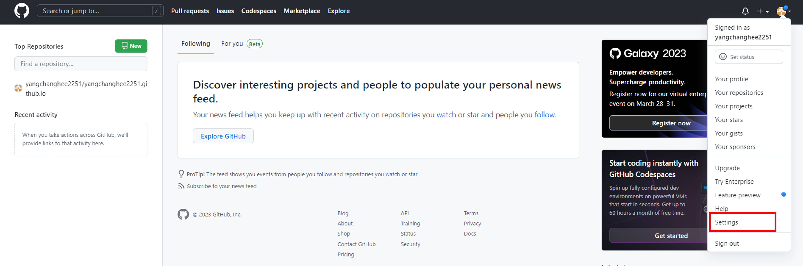
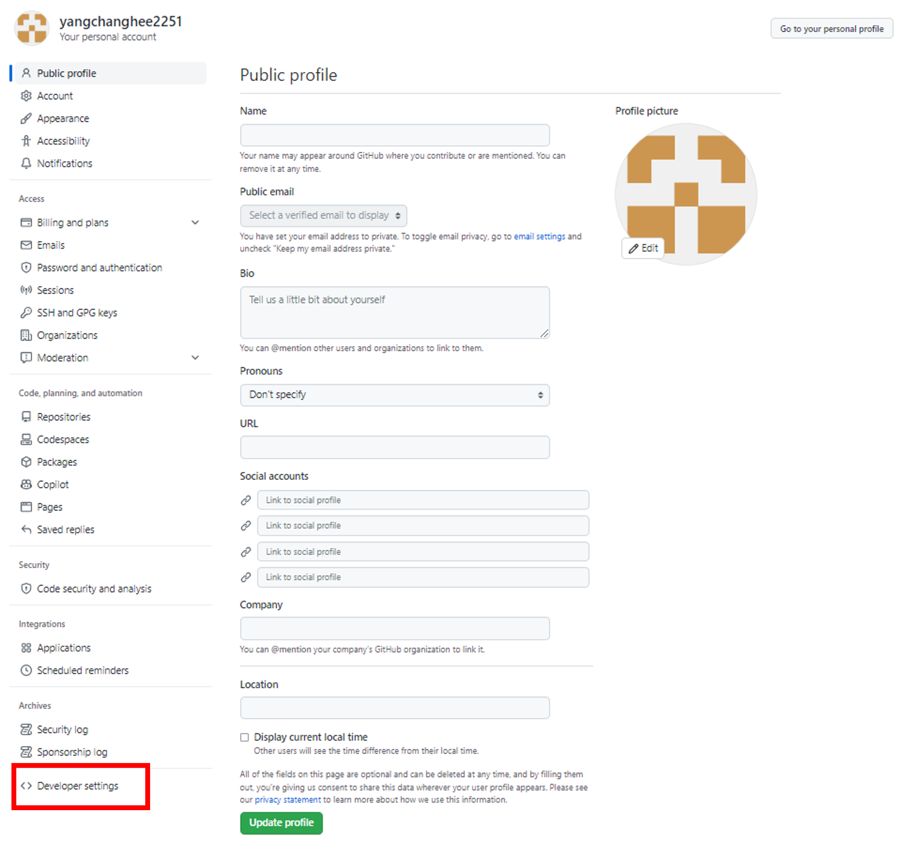
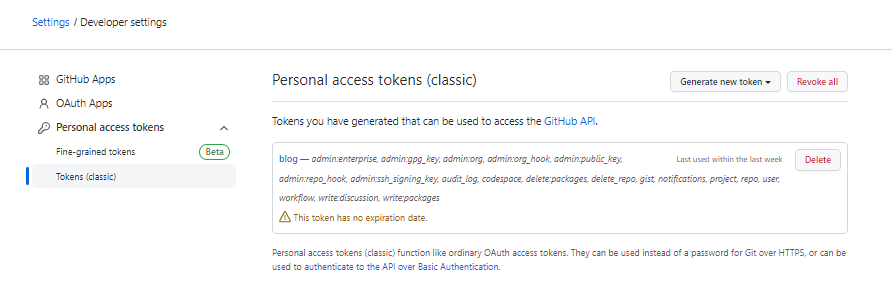
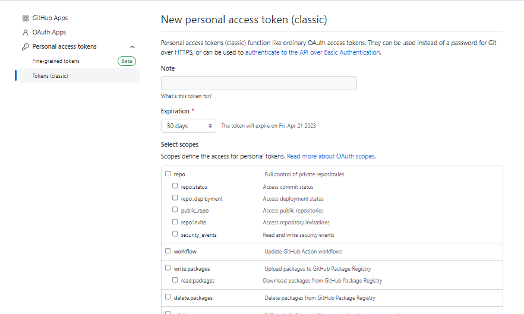
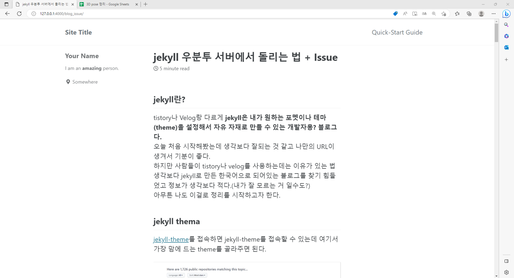

## jekyll란?

tistory나 Velog랑 다르게 **jekyll은 내가 원하는 포멧이나 테마(theme)을 설정해서 자유 자재로 만들 수 있는 개발자용? 블로그다.**  
오늘 처음 시작해봤는데 생각보다 잘되는 것 같고 나만의 URL이 생겨서 기분이 좋다.  
하지만 사람들이 tistory나 velog를 사용하는데는 이유가 있는 법  
생각보다 jekyll로 만든 한국어으로 되어있는 블로그를 찾기 힘들었고 정보가 생각보다 적다.(내가 잘 모르는 거 일수도?)  
아무튼 나도 이걸로 정리를 시작하고자 한다. 

## jekyll thema

[jekyll-theme](https://github.com/topics/jekyll-theme)를 접속하면 jekyll-theme를 접속할 수 있는데 여기서 가장 맘에 드는 theme를 골라주면 된다.  

  
위 그림 창이 뜨는데 난 여기서 가장 유명한 [minimal-mistakes](https://github.com/mmistakes/minimal-mistakes)를 골랐다. 참고로 모든 깃허브 소스 코드를 사용하거나 **fork하면 star를 누르도록 하자.(일반적인 매너로 알고있다.)**  
어찌어찌 하여 fork를 진행하면 내 레포토지로 오게되는데 setting을 눌러주도록 하자.  

  

이렇게 레포토지에서 setting을 누르면 아래와 같이 이름을 바꿔주자.(이름은 자기 아이디 + .github.io로 만들라고 하는데 나중에 이거 바꿀 수 있음 바꿔보도록 해보자.)  

  

레포토지에 존재하는 _config.yml file을 확인해보면 url을 바꿀수 있는데 내가 변경한 이름과 같은 url로 바꾸면 끝!  

  

위 그림과 같이 새로운 블로그가 생기게 된다! 

## posts를 만드는 방법

posts를 만드는 방법은 생각외로 간단했다.

1. 메인 레포토지에 _posts라는 folder를 만든다.
2. post할 파일을 만들건데 **yyyy-mm-dd-name.md**로 만들어야한다.(ex) 2023-03-22-blog.md)
3. md는 markdown의 약자이며 jupyter notebook을 사용해본 사용자에겐 익숙한 언어일 것이다. 그냥 markdown언어를 그대로 가져와 쓴다 생각하면된다.
4. 내가 알기론 html도 사용 가능하다고 하는데 추후에 진행해볼 계획이다.  

이렇게 1=>2=>3=>4 작업을 마치면 간단하게 post가 된다!  

  

위 그림은 대충 내가 논문 읽고 정리한 내용을 담은 post이다.(아직 안끝냈지만 언젠간 끝낼거다)  
이렇게 끝이면 좋겟지만 내가 이제부터 시작하려는건 학교 연구실 서버에서 블로그를 업데이트 시키면서 실시간으로 변경 내용을 확인해보고 완료가 되면 완성본을 github page에 보내는 것이다...(이렇게 안하면 나의 레포토지에 엄청난 contribution이 오르겠지만 쓸데 없는 작업이기 때문에 보기에 불편하다...)  
쉽게 요약해보자면 나의 레포지토리에서 바로 변경하는 것이 아니라  
**우리 학교 서버내에서 작업 => 완료 => github으로 push => 변경 내용 자동 업데이트 (설정해논 URL로)**  
이러한 작업을 진행하고 싶었다.

## Git Clone
우선 당연하듯 git clone을 진행했고 아무런 문제가 없이 clone을 완료하였다.(난 설마 여기서도 문제가 있을지 몰랐다.)  
그리고 간단한 테스트를 위해서 새로운 post를 만들어 보았고
```
git add .
git commit -m "test"
git push
```
작업을 진행했다.(맙소사... 바로 에러가 뜬다.)  
```
remote: Permission to yangchanghee2251/yangchanghee2251.github.io.git denied to YangChangHee.
fatal: unable to access 'https://github.com/yangchanghee2251/yangchanghee2251.github.io/': The requested URL returned error: 403
```
이게 먼 🐶같은 경우인가 평소에 연구하면서 한번도 본적이 없는 git push error라니...  
리눅스 국민 만병통치약 sudo를 사용해보았다.
```
Username for 'https://github.com': yangchanghee2251
Password for 'https://yangchanghee2251@github.com': 
remote: Support for password authentication was removed on August 13, 2021.
remote: Please see https://docs.github.com/en/get-started/getting-started-with-git/about-remote-repositories#cloning-with-https-urls for information on currently recommended modes of authentication.
fatal: Authentication failed for 'https://github.com/yangchanghee2251/yangchanghee2251.github.io/'
```
가볍게 id, password를 작성하는 건 줄 알고 해봤는데 안된다.
이게 무슨 상황인가 확인을 해보니 최근 github에서 보안을 올리기 위해서 git remote에 대한 token을 만들었다고 한다.  
따라서 비밀번호를 작성할 때 이제부터 token을 적어 인증을 하라는 건데...  
찾아본 결과 생각보다 간단했다.  

  

우선 내 프로필에서 setting을 들어간다.  

  
그 후에 developer settings를 들어가면된다.  

  

다음으로 token을 생성하면 되는데 **중요! token을 만들 때 classic이랑 다른거 하나 더 있는데 다른건 솔직하게 뭔지 모르겠고 classic을 들어가서 token을 만들어야 한다.** 그 다음 expiration은 최대한 많이 설정해주고 Select scopes는 그냥 다 선택해주도록 하자 솔직히 우리는 되기만 하면 입장 아니겠는가?  

  

이렇게 진행하면 ghp_~~~~이렇게 나오는데 싹다 복사 해준다음 비밀번호에 붙여넣기 해서 실행하면 이전에 진행되지 않았던 작업이 진행된다.

```
Username for 'https://github.com': yangchanghee2251
Password for 'https://yangchanghee2251@github.com': 
Counting objects: 12, done.
Delta compression using up to 24 threads.
Compressing objects: 100% (12/12), done.
Writing objects: 100% (12/12), 5.68 MiB | 3.85 MiB/s, done.
Total 12 (delta 2), reused 0 (delta 0)
remote: Resolving deltas: 100% (2/2), completed with 2 local objects.
To https://github.com/yangchanghee2251/yangchanghee2251.github.io
   17b70f92..10fe42dc  master -> master
```

좋다. 이제 30% 왔다. 이제 git push까지 됬으니 작업을 서버상에서 돌리고 싶은데 어떻게 해야되는 지 알고싶다면 밑에를 보면 된다.

## Working on jekyll on Linux
이제 나머지 70%를 할 차례이다. 진짜 이거 때문에 2시간 날린거 생각하면 화가 치밀어 오르지만 나중과 나와 같은 불편함을 겪고 있는 사람을 위해서 정리하도록 하자.  
[jekyll-ko-Linux](https://jekyllrb-ko.github.io/docs/installation/ubuntu/) 여기를 들어가면 우분투에서 jekyll를 사용할 수 있는 방법을 알려준다!(오! 정말 간단하고 여기서 말하는 것처럼 금방 될 줄 알았다.ㅎㅎ)  
시작은 문제가 없다.  
리눅스 apt-get install를 하기전 update는 국룰이며 ruby와 빌드에 필요한 의존성들을 추가한다.
```
sudo apt-get update
sudo apt-get install ruby-full build-essential zlib1g-dev
```
여기까진 문제가 없다 ㅎㅎ  
```
echo '# Install Ruby Gems to ~/gems' >> ~/.bashrc
echo 'export GEM_HOME="$HOME/gems"' >> ~/.bashrc
echo 'export PATH="$HOME/gems/bin:$PATH"' >> ~/.bashrc
source ~/.bashrc
```
그 다음으로 리눅스를 사용하면 root나 다양한 사용자들 전부 ~/.bashrc가 존재하는데 여기에 gem 설치 경로나 path를 설정해준다.

```
gem install jekyll bundler
```
마지막으로 jekyll를 설치하면 끝이다! 이제 홈페이지에서 말한대로 jekyll만 사용하면 된다!
```
ERROR:  Error installing jekyll:
        The last version of google-protobuf (~> 3.21) to support your Ruby & RubyGems was 3.22.2. Try installing it with `gem install google-protobuf -v 3.22.2` and then running the current command again
        google-protobuf requires Ruby version < 3.3.dev, >= 2.6. The current ruby version is 2.5.0.
ERROR:  Error installing bundler:
        The last version of bundler (>= 0) to support your Ruby & RubyGems was 2.3.26. Try installing it with `gem install bundler -v 2.3.26`
        bundler requires Ruby version >= 2.6.0. The current ruby version is 2.5.0.
```
??? 분명 홈페이지에서 말한대로 했는데 왜 Error가 나는가? 에러를 자세히 읽어 보니 ruby 버젼을 올리라는 것 같아서 진짜 rvm등 웬만한 웹페이지에서 다 찾아서 ruby 버젼을 올려봤는데도 안된다...  
도대채 무엇이 문제인가? 하고 ~/.bashrc를 확인해 봤는데 위에 path랑 gem 설치 경로 설정이 없다?  
약간 sudo 문제인것 같아서 sudo를 붙여서 진행해 보았다.
```
sudo echo '# Install Ruby Gems to ~/gems' >> ~/.bashrc
sudo echo 'export GEM_HOME="$HOME/gems"' >> ~/.bashrc
sudo echo 'export PATH="$HOME/gems/bin:$PATH"' >> ~/.bashrc
source ~/.bashrc
```
거의다 됬는데 또 jekyll가 아래와 같은 에러가 나온다고 한다. 머리가 뜨거워진다.
```
ERROR:  Error installing jekyll:
        The last version of sass-embedded (~> 1.54) to support your Ruby & RubyGems was 1.59.3. Try installing it with `gem install sass-embedded -v 1.59.3` and then running the current command again
        sass-embedded requires RubyGems version >= 3.3.22. The current RubyGems version is 3.1.4. Try 'gem update --system' to update RubyGems itself.
Successfully installed bundler-2.4.9
Parsing documentation for bundler-2.4.9
Done installing documentation for bundler after 0 seconds
1 gem installed
```
그래도 대충 설치 됬으니까 혹시나 하는 마음에 아래 코드를 실행해 보았다.
```
bundle exec jekyll serve
```
에러가 떳는데 되겠는가? 당연히 안된다. 그러면서 아래와 같은 에러 코드가 나왔는데 난 설마 저 bundle install이 진짜 bundle을 설치한다는 뜻인지 모르고 `bundle install jekyll, gem update --system`와 같이 노가다를 해본 끝에 bundle install 하니 설치가 됬다.
```
bundler: command not found: jekyll
Install missing gem executables with `bundle install`
```
최종 해결
```
bundle install
```
이제 `bundle exec jekyll serve` 를 진행할 건데 그냥 가장 메인 레포토지에서 바로 작성하면 진행이 된다.  
아래는 완료된 사진  
  

## 후기
진짜 이거 한다고 2~3시간 날렸는데 에러 코드 찾으면서 jekyll이 버젼을 업데이트 하지 않는다는 가슴 철렁이는 블로그를 본 것 같다. 설마 지금 내가하고 있는 작업이 헛수고로 돌아가진 않겠지...?