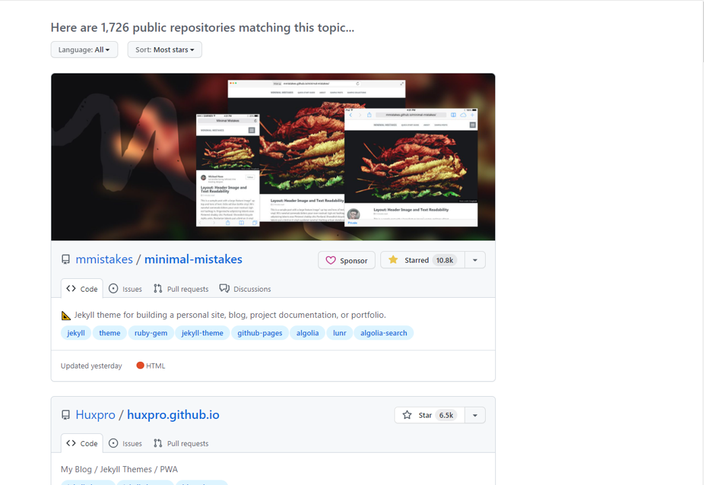
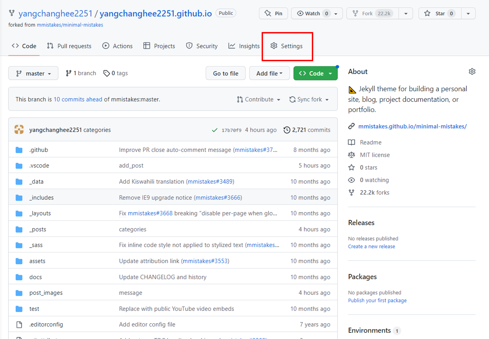
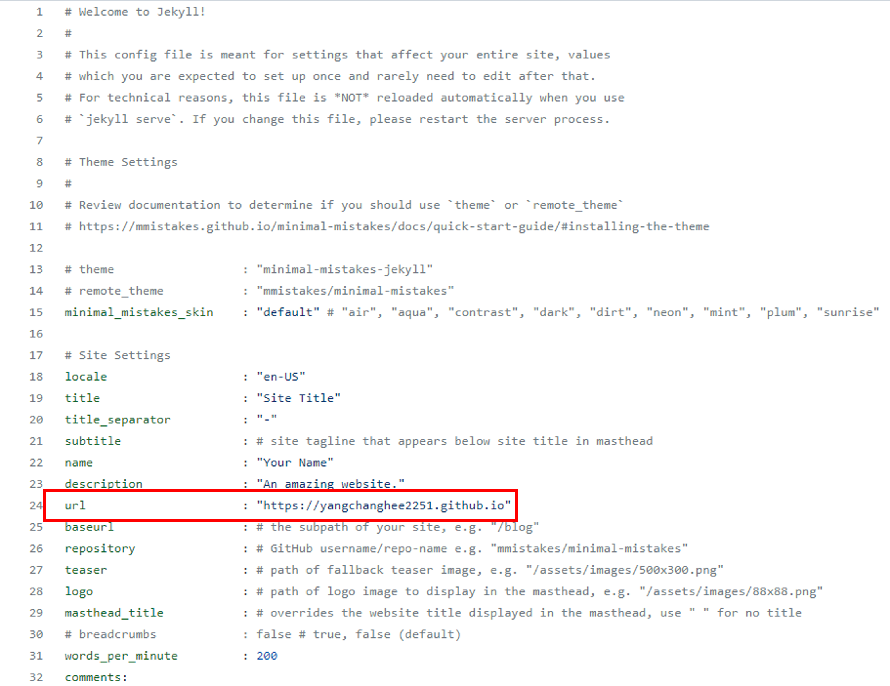
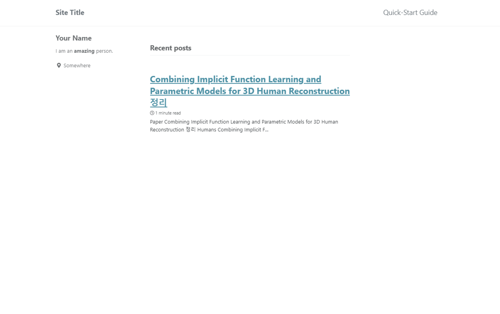

## jekyll란?

tistory나 Velog랑 다르게 **jekyll은 내가 원하는 포멧이나 테마(theme)을 설정해서 자유 자재로 만들 수 있는 개발자용? 블로그다.**  
오늘 처음 시작해봤는데 생각보다 잘되는 것 같고 나만의 URL이 생겨서 기분이 좋다.  
하지만 사람들이 tistory나 velog를 사용하는데는 이유가 있는 법  
생각보다 jekyll로 만든 한국어으로 되어있는 블로그를 찾기 힘들었고 정보가 생각보다 적다.(내가 잘 모르는 거 일수도?)  
아무튼 나도 이걸로 정리를 시작하고자 한다. 

## jekyll thema

[jekyll-theme](https://github.com/topics/jekyll-theme)를 접속하면 jekyll-theme를 접속할 수 있는데 여기서 가장 맘에 드는 theme를 골라주면 된다.  

  
위 그림 창이 뜨는데 난 여기서 가장 유명한 [minimal-mistakes](https://github.com/mmistakes/minimal-mistakes)를 골랐다. 참고로 모든 깃허브 소스 코드를 사용하거나 **fork하면 star를 누르도록 하자.(일반적인 매너로 알고있다.)**  
어찌어찌 하여 fork를 진행하면 내 레포토지로 오게되는데 setting을 눌러주도록 하자.  

  

이렇게 레포토지에서 setting을 누르면 아래와 같이 이름을 바꿔주자.(이름은 자기 아이디 + .github.io로 만들라고 하는데 나중에 이거 바꿀 수 있음 바꿔보도록 해보자.)  

  

레포토지에 존재하는 _config.yml file을 확인해보면 url을 바꿀수 있는데 내가 변경한 이름과 같은 url로 바꾸면 끝!  

  

위 그림과 같이 새로운 블로그가 생기게 된다! 

## posts를 만드는 방법

posts를 만드는 방법은 생각외로 간단했다.

1. 메인 레포토지에 _posts라는 folder를 만든다.
2. post할 파일을 만들건데 **yyyy-mm-dd-name.md**로 만들어야한다.(ex) 2023-03-22-blog.md)
3. md는 markdown의 약자이며 jupyter notebook을 사용해본 사용자에겐 익숙한 언어일 것이다. 그냥 markdown언어를 그대로 가져와 쓴다 생각하면된다.
4. 내가 알기론 html도 사용 가능하다고 하는데 추후에 진행해볼 계획이다.  

이렇게 1=>2=>3=>4 작업을 마치면 간단하게 post가 된다!  

  

위 그림은 대충 내가 논문 읽고 정리한 내용을 담은 post이다.(아직 안끝냈지만 언젠간 끝낼거다)  
이렇게 끝이면 좋겟지만 내가 이제부터 시작하려는건 학교 연구실 서버에서 블로그를 업데이트 시키면서 실시간으로 변경 내용을 확인해보고 완료가 되면 완성본을 github page에 보내는 것이다...(이렇게 안하면 나의 레포토지에 엄청난 contribution이 오르겠지만 쓸데 없는 작업이기 때문에 보기에 불편하다...)  
쉽게 요약해보자면 나의 레포지토리에서 바로 변경하는 것이 아니라  
**우리 학교 서버내에서 작업 => 완료 => github으로 push => 변경 내용 자동 업데이트 (설정해논 URL로)**  
이러한 작업을 진행하고 싶었다.

## Git Clone
우선 당연하듯 git clone을 진행했고 아무런 문제가 없이 clone을 완료하였다.(난 설마 여기서도 문제가 있을지 몰랐다.)  
그리고 간단한 테스트를 위해서 새로운 post를 만들어 보았고
```
git add .
git commit -m "test"
git push
```
작업을 진행했다.(맙소사... 바로 에러가 뜬다.)  
이 에러 내용을 따로 작성하지 않아서 