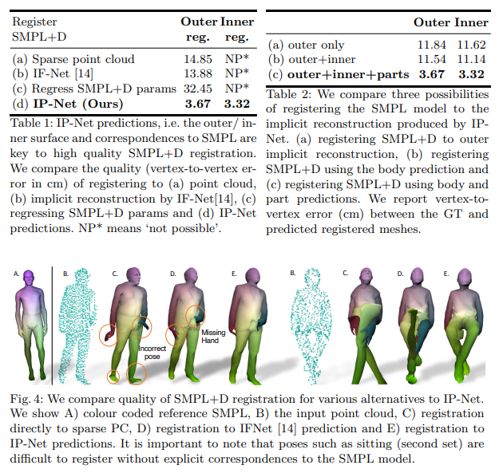

# Combining Implicit Function Learning and Parametric Models for 3D Human Reconstruction

이번에 새로 과제를 할당 받으면서 처음 접하게 된 분야로 사람의 Point Cloud를 얻어 SMPL과 관련된 모델을 이용해 SMPL parameter를 얻는걸 해보게 됬다.  
(특히 shape 이쪽으로)

## Abstact

이 연구의 경우 일반적인 SMPL과 다르게 의류, 얼굴 및 머리카락까지 포착하는 mesh 모델을 얻기 위해 진행한 연구인듯 하다.  
신체 전체 및 hand scan을 모두 사용한 정량적, 정성적 실험에서 가장 좋다고 주장함.

## Intro

의류를 사용하면 문제가 되는 것이 신체 부위를 정확히 찾기 모호하기 때문이라고 주장하고 있음.  
저자들은 이를 해결하기 위해서 사람의 포즈 뿐만 아니라 의류까지 mesh 형태로 뽑는 연구를 진행함.  
여기서 2가지 방법을 설명하는데 Learning-based 방법의 경우 불완전한 point cloud를 처리하는데 적합하지만 해상도나 표면 제어를 제한하고 implicit function의 경우 포즈와 모양을 제어하는 모델이 없는 정적 표면이라는 문제가 있다고 언급함.  
하지만 SMPL의 경우 제어가 가능하지만 표면이 너무 매끄럽고 매개변수를 정확하게 회귀시키기 어렵다고 언급함.  
또한 SMPL은 의류를 나타낼수 없음을 언급 함 밑에 table은 각 방법에 대한 결과를 보여줌.

이 논문은 두 representation의 장점을 모두 활용하면서 최적화 기반 registration을 실현하기 위해 의류, 신체등을 예측하는 방법을 진행함.  
그림 4에서 오른쪽 그림은 sitting에 대한 그림으로 sitting은 잘 안나오는 걸 확인 가능함.

* 외부(신체+의류)와 내부(신체) 표면의 공동 점유
* 신체 부위 라벨에 대한 2가지 implicit 기능을 공동으로 학습하는 구조

대충 보니까 내부/외부 표면을 예측하는 classifier를 만들겠단 소리 같음.  
* Contribution
> implicit 기능과 매개 변수 모델링을 결합해 복장을 한 mesh를 구함  

> 의류 아래에 신체를 구현한 것이 첫번째 접근임

> MONO에서 광범위한 적용 가능성을 보여준다.  

마지막은 좀 이해가 안되는게 왜 MANO에서만 한거지?

