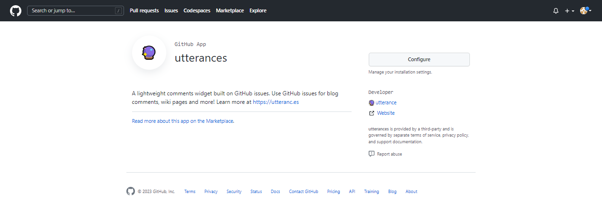
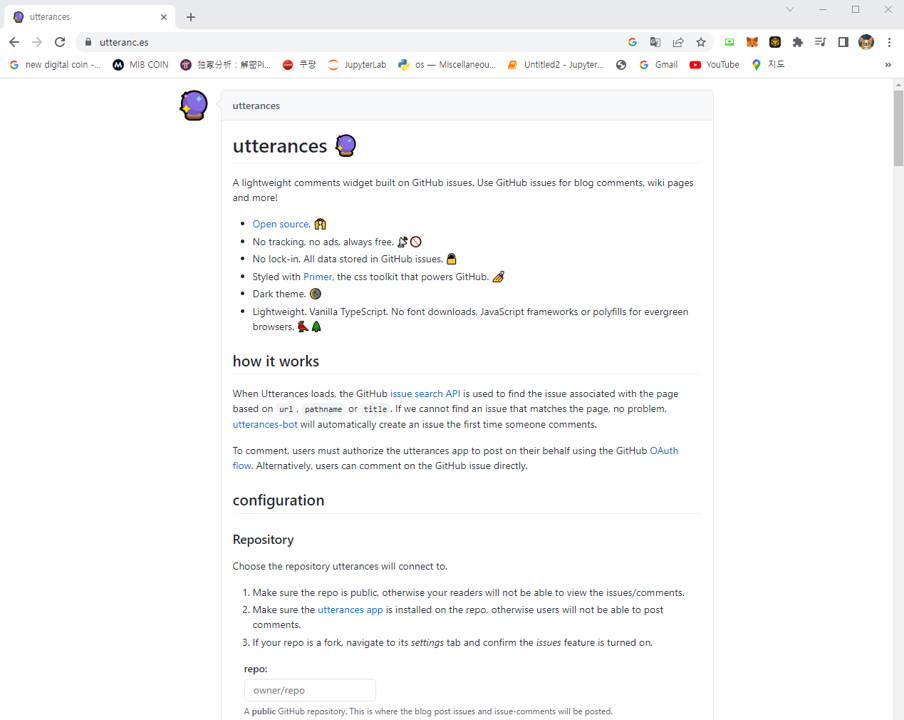
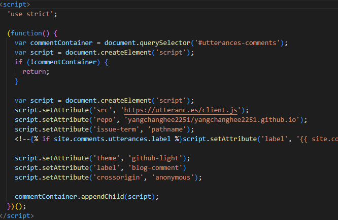
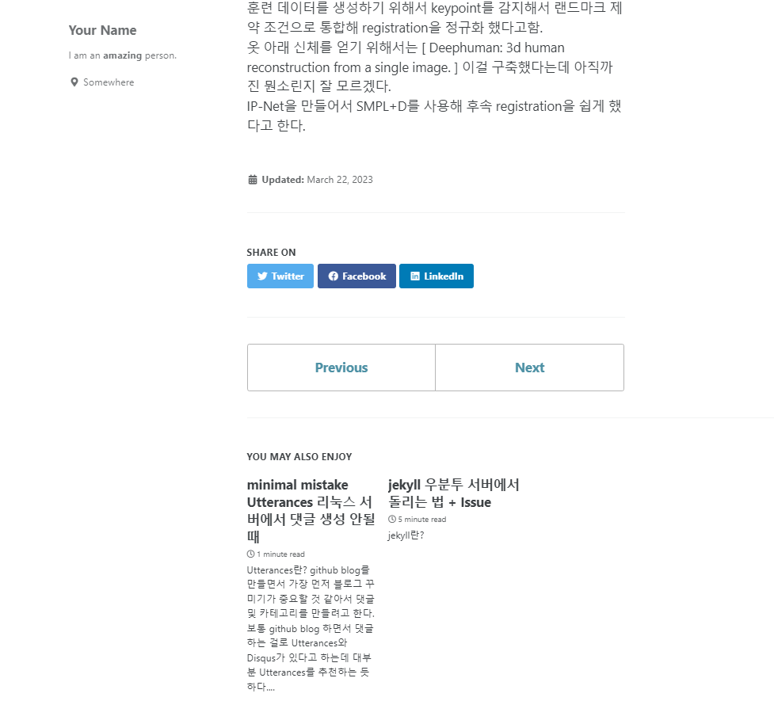
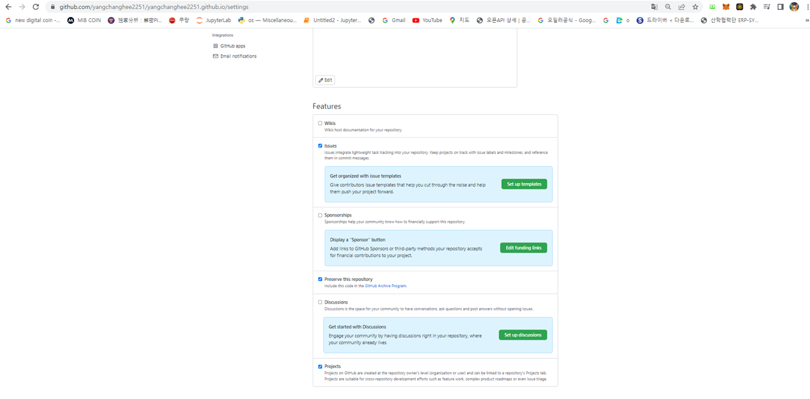
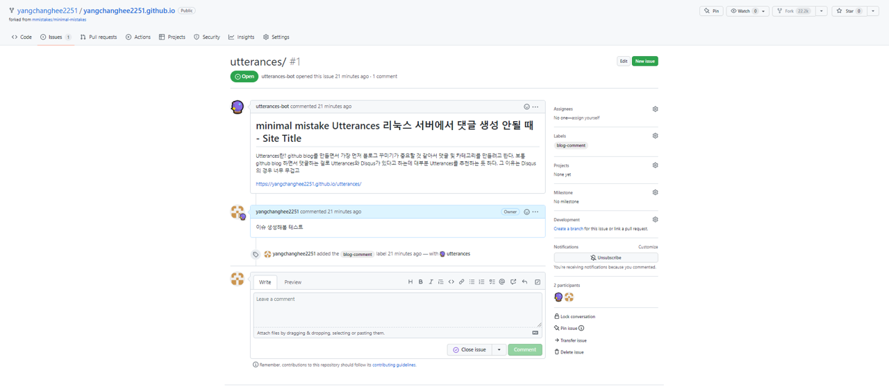

## Utterances란?
github blog를 만들면서 가장 먼저 블로그 꾸미기가 중요할 것 같아서 댓글 및 카테고리를 만들려고 한다.  
보통 github blog 하면서 댓글하는 걸로 Utterances와 Disqus가 있다고 하는데 대부분 Utterances를 추천하는 듯 하다.  
**그 이유는 Disqus의 경우 너무 무겁고 무료 라이센스를 사용하면 광고가 붙는다 하니 다들 껴러하는 눈치다.**  
또한 github에서 지원하는 app인듯 하여 라이센스를 부여하는 일은 없을 듯 하다?

## 어떻게 적용하는가?
생각보다 간단한데 Jekyll를 사용하면서 Utterances를 사용하면 보통 _layouts에 있는 posts.html에 적용시키는데 minimal mistake는 아무래도 많이 쓰는 추세다 보니까 이미 사용하기 편하도록 구성이 미리 되어있는 듯 하다.  

하지만 minimal mistake를 언젠간 나도 바꿀 날이 올 수도 있으니 두가지 전부 알아보도록 하자

## minimal mistake를 안쓰는 경우

### 작업 1
[Utterances](https://github.com/apps/utterances)에 접속을 하면 아래와 같은 github url을 들어가게 된다.  

  

처음에 들어가게 되면 install이 뜨게 되는데 install을 누르면 All repositories, Only select repositories가 있는데 여기서 난 only selet repositories를 선택하고 install을 진행함 이렇게 진행하면 utterances config code를 얻을 수 있는 홈페이지가 나오게 됨.  
### 작업 2
  
[여기](https://utteranc.es/)를 들어가면 아래 그림 처럼 홈페이지가 들어가게되는데 가장 중요한건 Configuration에 있는 Repository에 repo:라고 되어 있는 곳에 제대로 넣어야된다는 점이다.
```
yangchanghee2251/yangchanghee2251.github.io
```
나는 위와 같이 설정했다.

Theme, label, Blog post등 다양한 설정이 가능하고 그냥 처음엔 Default로 해도 상관이 없다.

마지막에 Enable Utterances에 보면 Code file이 나오는데 default로 설정하면 대충 다음과 같은 코드가 나올 거다.
```
<script src="https://utteranc.es/client.js"
        repo="[ENTER REPO HERE]"
        issue-term="pathname"
        theme="github-light"
        crossorigin="anonymous"
        async>
</script>
```
이거를 _layouts => posts.html에 작성하면 되는데 minimal mistake의 경우에는 이러한 작업이 진행이 안된다.  
따라서 다르게 진행해야 되는데 minimal mistake가 좀 더 쉽게 적용할 수 있어서 좋다.

## minimal mistake를 사용하는 경우
minimal mistake를 사용하는 경우 작업 1만 진행을 하면 되고 그 후에 _config.yml을 수정해주면 된다.  
  

나는 다음과 같이 수정을 진행했는데 comments => provider를 utterances로 설정해준다음 utterances => theme, issue_term은 default로 설정해줬다. 그 다음 _config.yml file에서 마지막을 보면 다음과 같은 코드가 있다.
```
# Defaults
defaults:
  # _posts
  - scope:
      path: ""
      type: posts
    values:
      layout: single
      author_profile: true
      read_time: true
      comments: true
      share: true
      related: true
```
이렇게 코드가 있는데 나와 같이 수정하면 된다. comments는 true로 바꿔야하는데 이유가 comments를 넣기 위해서는 넣어야 한다고 하더라 그다음 _include => comments-providers => utterances.html로 들어가 면 아래와 같은 창이 나오는데  
  
다음과 같이 변경했다. 그 이유는 script에 직접적으로 들어가는 파일인데 여기를 보다 정확하게 넣고 싶어서 변경했다.  
이렇게까지 진행하면 끝! 인줄 알았으나 문제가 발생했다.

## local server에서 댓글 창이 안나옴
이거 나만 이런지 모르겠는데 나같은 경우 linux 서버에서 순차적으로 진행하고 있는데 확인해본 결과 github 댓글이 생성이 안됬다.  
  
혹시 URL이 local로 되어있어서 안되는거 아닌가 싶어서 git push를 진행해본 결과 github page에서는 제대로 나오는 걸 확인했다.
  
이 문제가 생기는 이유는 아마 URL이 달라서 댓글이 생성되지 않는 것 같았다.  
(아니근데 다른 블로그 가보면 전부다 생성되던데 왜 나만 안되는가? 이유 아는 사람 있으면 댓글로 알려주면 정말 좋을것 같다 ㅎㅎ)

## 댓글을 달아도 댓글이 안달림
다른 블로그 보면 이런 문제가 없던데 나만 억까 당하는건가 계속 찾아본 결과 제대로된 문제 해결 블로그를 찾기 힘들었다.  
그래서 자체적으로 뭐가 문제인가 확인을 해보니 내가 포크해온 레포토지에 issue가 없었다. 왜 이런 문제가 생긴건지 모르겠는데 우선 이슈를 직접 만들어보기로 해봤다.  
  
이렇게 이슈에 check를 해주면 이슈가 생성된다. github issue를 확인해보니 내가 달았던 댓글이 달린걸 확인할 수 있었다.
  
댓글 시스템이 이슈로 되어 있어서 이슈가 레포토지에 없어서 댓글이 안달린 것 같았다.

## 후기
여러가지로 많은 문제가 있었지만 그래도 점점 내 블로그가 완성되가고 있는 것 같다.
